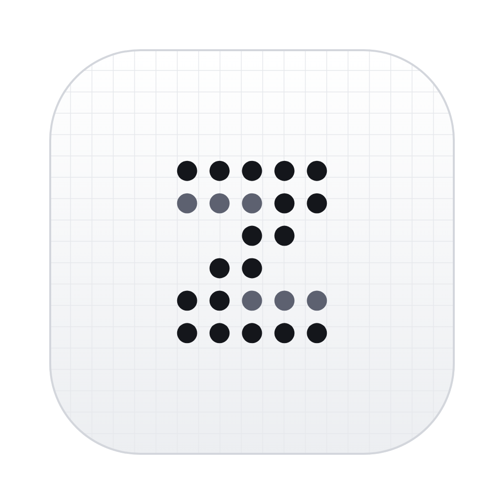

<p align="center">
  
</p>

<h1 align="center">ScriptZ</h1>

<p align="center">
  <strong>Write, don't format.</strong><br/>
  <em>The script editor for TikTok, Reels and YouTube Shorts creators.</em>
</p>

<p align="center">
  <a href="https://github.com/AgentZ-Media/ScriptZ/releases/latest"></a>
  
  
</p>

<p align="center">
  
  
  
  
</p>

<p align="center">
  <a href="https://github.com/AgentZ-Media/ScriptZ/releases/latest">download</a>
</p>

---

## From empty cursor to finished script in minutes

App opens → you type → format happens → export → done. No login, no cloud, no telemetry, no AI. Everything stays as a single SQLite file on your computer.

**Final Draft** is too heavy. **Google Docs** is too generic. **Arc Studio** wants your subscription. **ScriptZ is the middle nobody else builds.**

---

## Why creators pick ScriptZ

### ⚡ Quick Mode – the trick nobody else does

Two speakers in your script? After every dialog line, **one Enter** jumps the cursor to the other character, right into the next dialog. No Tab, no typing the speaker name, no second Enter. Saves two keystrokes per switch – about a minute per 60-second reel.

The moment a third character shows up, Quick Mode pauses on its own. Drop back to two, and it's back. It switches itself on – the toggle in the header bar is only there if you ever want it off.

### ✍️ Format happens, you don't

- Four block types, nothing to learn: **Action**, **Character**, **Dialog**, **Parenthetical**. `⌘1`–`⌘4` switches, `Tab` opens the block picker, `Enter` moves on to the block you most likely want next.
- Type `(` inside a dialog line and it becomes a parenthetical – a delivery cue like *(quietly)* under the character name. `)` takes you straight back into the dialog.
- Character names auto-centered and visually all-caps – without rewriting your data.
- One endless writing sheet. Pages only exist where they belong: in the PDF.
- Bold and underline where they make sense. Italic is left alone, because `⌘I` belongs to quick capture.
- Coming from an older version? Camera, Caption and SFX blocks are converted to Action automatically – your text stays. Parentheticals stay parentheticals.

### 🎨 Characters as first-class citizens

Every character gets its own color, automatically. The inspector shows everyone's share of the speaking time. Autocomplete predicts who's likely to speak next, based on the actual dialog flow. All per-script – no global address book, no setup.

### ⏱️ Target length + timeline

Give a folder a target range – say `0:45–1:05` – or set a global default. Below the range you get a quiet hint, inside it everything stays neutral, and only past the upper bound does the runtime turn red ("10 s too long"). The range answers a question you ask anyway; it judges the script, not you.

`⌘J` opens the timeline under the sheet: one lane per speaker, the hook zone (first 3 seconds), the target band and the upper-bound line, with a playhead that follows your cursor. Hover a segment to highlight its line on the sheet, click it to jump there. The runtime is an estimate based on your speaking rate (default 210 WPM).

### 🗂️ A pipeline from idea to online

Every script has a stage: **Ideas → Writing → Ready to shoot → Shot → Online**. The sidebar shows how many pieces sit in each stage, the stage chip in the header bar moves a script along (`⌘⌥→` / `⌘⌥←`). Folders stay what they're good at: topic, client, series.

### 📄 Export 1:1 like on paper

The export dialog shows a live preview of the first page. PDF export with the embedded iA Writer Quattro font, optional title page, and the same character highlights as in the editor – tight per-line pills, not block-wide bands. Plain text for teleprompters, `.scriptz` files to move a script between machines. Print-ready A4 with widow/orphan control so character names and dialog never split.

### 🔁 Auto-snapshots, no panic

Every 5 minutes ScriptZ takes a silent snapshot. Manual one with `⌘⇧S`. Up to 50 versions per script, restorable anytime via `⌘⇧H` – and listed in the inspector, right next to your text.

### 🌱 A writing counter, not a scoreboard

No weekly goal, no streak, no sprint timer. The sidebar shows a calm counter – "1,240 words this week" – and falls back to the month or year when the week is still empty, so it doesn't greet you with a zero. When you only want the sheet, focus mode (`⌘⇧F`) hides the sidebar, inspector and timeline.

### 🧠 No AI. On purpose.

No "improve this" button. No autocomplete beyond character names from your own script. No chat sidebar. Your voice is the product – if a model writes half of it, half the voice is the model's. Quick capture and focus mode are there for the moments you'd otherwise reach for ChatGPT.

### 🔒 Local. Offline. Yours.

No login. No cloud. No telemetry. The entire app is a `~10 MB` native binary plus one SQLite file with your scripts. Works on a plane, in a basement, anywhere.

---

## Compared to what you might be using

|                                        | ScriptZ | Final Draft | Google Docs | Arc Studio |
|----------------------------------------|:-------:|:-----------:|:-----------:|:----------:|
| Local & offline                        | ✅      | ✅          | ❌          | ❌         |
| No account / login                     | ✅      | ⚠️          | ❌          | ❌         |
| No telemetry                           | ✅      | ⚠️          | ❌          | ❌         |
| App start under 1s                     | ✅      | ❌          | —           | ⚠️         |
| Short-form / sketch layout             | ✅      | ❌          | ❌          | ⚠️         |
| Auto character colors                  | ✅      | ❌          | ❌          | ✅         |
| Quick Mode (2 speakers)                | ✅      | ❌          | ❌          | ❌         |
| Speaker prediction                     | ✅      | ❌          | ❌          | ❌         |
| Target length range + speaker timeline | ✅      | ❌          | ❌          | ❌         |
| Pipeline stages (idea → online)        | ✅      | ❌          | ❌          | ⚠️         |
| Ideas page with quick capture          | ✅      | ❌          | ❌          | ❌         |
| Free                                   | ✅      | ❌          | ✅          | ⚠️         |

---

## Keyboard shortcuts

### Global

| Shortcut | Action |
|---|---|
| `⌘K` | Search & commands (empty shows recently opened) |
| `⌘N` | New script (in the current folder) |
| `⌘I` | Capture an idea (works anywhere, even in focus mode) |
| `⌘[` / `⌘]` | Back / forward |
| `⌘\` | Show / hide sidebar |
| `⌘⇧\` | Show / hide inspector |
| `⌘,` | Settings |

### Script view

| Shortcut | Action |
|---|---|
| `⌘J` | Show / hide timeline |
| `⌘⌥→` / `⌘⌥←` | Next / previous stage |
| `⌘⇧F` | Focus mode |
| `⌘E` | Export dialog |
| `⌘⇧S` | Manual snapshot |
| `⌘⇧H` | Version history |

### Editor

| Shortcut | Action |
|---|---|
| `⌘1` / `⌘2` / `⌘3` / `⌘4` | Action / Character / Dialog / Parenthetical |
| `(` / `)` in a dialog line | Open a parenthetical / back to the dialog |
| `Tab` | Block-type picker for the current block |
| `Enter` | Smart-advance to the next block type |
| `⌘B` / `⌘U` | Bold / Underline (Action & Dialog) |
| `⌘↵` | Start a script from the selected idea (on the ideas page) |

> On Windows, `⌘` means `Ctrl`. The app handles that automatically – the labels you see in-app match your platform.

---

## Install

### macOS (Apple Silicon)

> Tested on macOS 26 Tahoe. Minimum: macOS 13.

1. Grab the latest `.dmg` from [Releases](https://github.com/AgentZ-Media/ScriptZ/releases/latest).
2. Open it and drag **ScriptZ** to your **Applications** folder.
3. First launch only – run this once in Terminal to remove the Apple quarantine flag:

   ```bash
   xattr -cr /Applications/ScriptZ.app
   ```

ScriptZ is open source and not registered with Apple – that's why macOS asks for this step. Auto-updates work without any further friction after that.

### Windows (x64)

> Tested on Windows 11. Minimum: Windows 10.

1. Grab the latest `.exe` (NSIS installer) from [Releases](https://github.com/AgentZ-Media/ScriptZ/releases/latest).
2. Double-click – installs to your user folder, no admin needed.
3. First launch only – **Windows SmartScreen** pops up. Click **"More info"**, then **"Run anyway"**.

ScriptZ doesn't (yet) have an EV code-signing certificate – that's why SmartScreen asks for this step. Auto-updates work without any further friction after that.

---

## Tech under the hood

For the curious – this stays out of the way of writing, but if you want to know:

| Layer | Tool |
|---|---|
| Shell | [Tauri 2](https://tauri.app) (Rust, ~10 MB binary, native macOS + Windows) |
| UI | [Solid.js](https://solidjs.com) + TypeScript |
| Editor | [Lexical](https://lexical.dev) (vanilla, no `@lexical/react`) |
| Storage | SQLite with FTS5 for full-text search |
| Fonts | iA Writer Quattro on the sheet, Schibsted Grotesk for the UI (both SIL OFL 1.1, bundled offline) |
| Auto-update | `tauri-plugin-updater` with signed releases |

---

## Building from source

This repository is a pnpm monorepo. The Tauri app lives in [`apps/desktop/`](apps/desktop/), the editor and application logic in [`packages/core/`](packages/core/), and the shared design system in [`packages/design/`](packages/design/).

```bash
pnpm install              # install all workspaces
pnpm dev:desktop          # Tauri dev (hot-reload frontend + Rust)
pnpm build:desktop        # build the native binary
pnpm typecheck            # TypeScript across all workspaces
pnpm test                 # run workspace tests
```

Code conventions are in [`CLAUDE.md`](CLAUDE.md) (monorepo overview) and [`apps/desktop/CLAUDE.md`](apps/desktop/CLAUDE.md) (app details).

---

## License & credits

- **MIT License** – see [LICENSE](LICENSE).
- Fonts: **iA Writer Quattro** © Information Architects Inc., SIL OFL 1.1 · **Schibsted Grotesk** © The Schibsted Grotesk Project Authors, SIL OFL 1.1.
- Built by [AgentZ](https://linktr.ee/deragentz).

<p align="center">
  <sub><strong>No login. No tracking. No cloud. Just you, your script, and your computer.</strong></sub>
</p>
